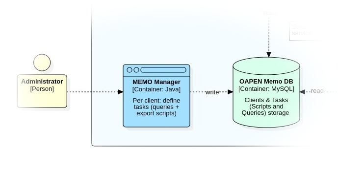

# MEMO Manager

MEMO Manager provides the environment to create and manage clients and their tasks.

Clients consist of a user account (login credentials) and some additional info describing the client. 
Tasks consist of scripts written in Python and SQL that are run periodically by [MEMO Task Manager](../MEMO-Taskrunner/README.md). 
On each run an output file is generated that is stored in the clients web space. Clients have access 
to the generated files via the [MEMO Client Web](../MEMO-Clientweb/README.md). 

MEMO Manager is only available to user accounts that provide access to all clients and their tasks and library items (scripts and queries). 
Only users with the `administrator` privilege can access and manage settings and users.

MEMO Manager stores all data - clients, tasks, settings, scripts and queries - in the [MEMO database](../Supplements/Diagrams/ERD-MEMO.jpg).  

For a more precise description of the MEMO Manager application, including instructions on how to install, configure and run, go to https://github.com/trilobiet/oapenmemomanager.

