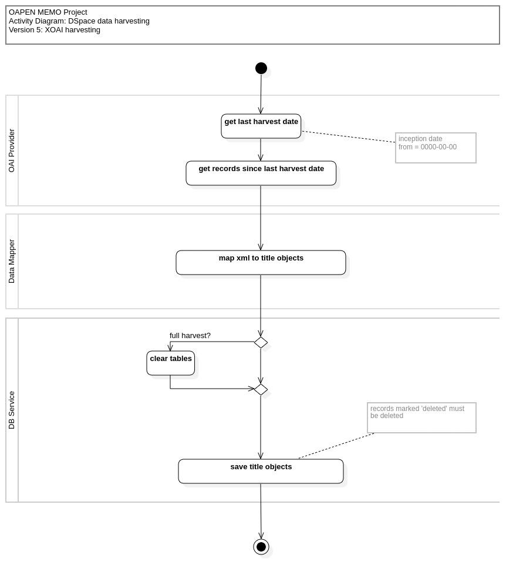

#  Library Data

OAPEN/DOAB Library data is stored locally in a MySQL database that is a relational mapping of data retrieved from OAPEN DSpace, harvested through the OAI protocol and synchronized daily with the OAI provider at `library.oapen.org/oai` or `directory.doabooks.org/oai`. 

To initially populate the local datastore and synchronize afterwards, an OAI harvester application is run as a daily job, keeping track of harvesting status.

The resulting database can be used as a datasource for MEMO export file generation, but its use is not restricted to that, since it contains quite a complete description of the collection of Library titles (books and chapters) and associated data.

For a more precise description of the Harvester application, including instructions on how to install, configure and run, go to [https://github.com/trilobiet/oapenmemoharvester](https://github.com/trilobiet/oapenmemoharvester).

## XOAI Harvesting process

*Diagrams and HTML Database documentation are created with StarUML Professional 6.0.0*