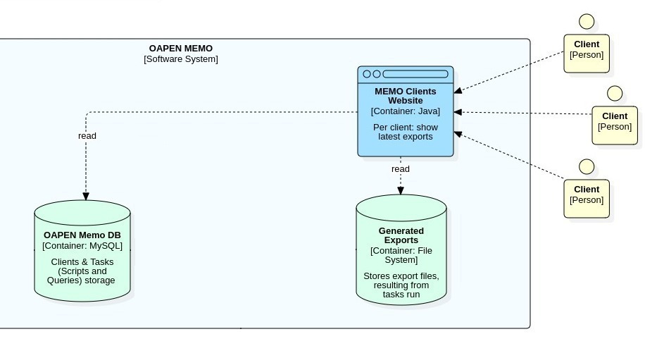
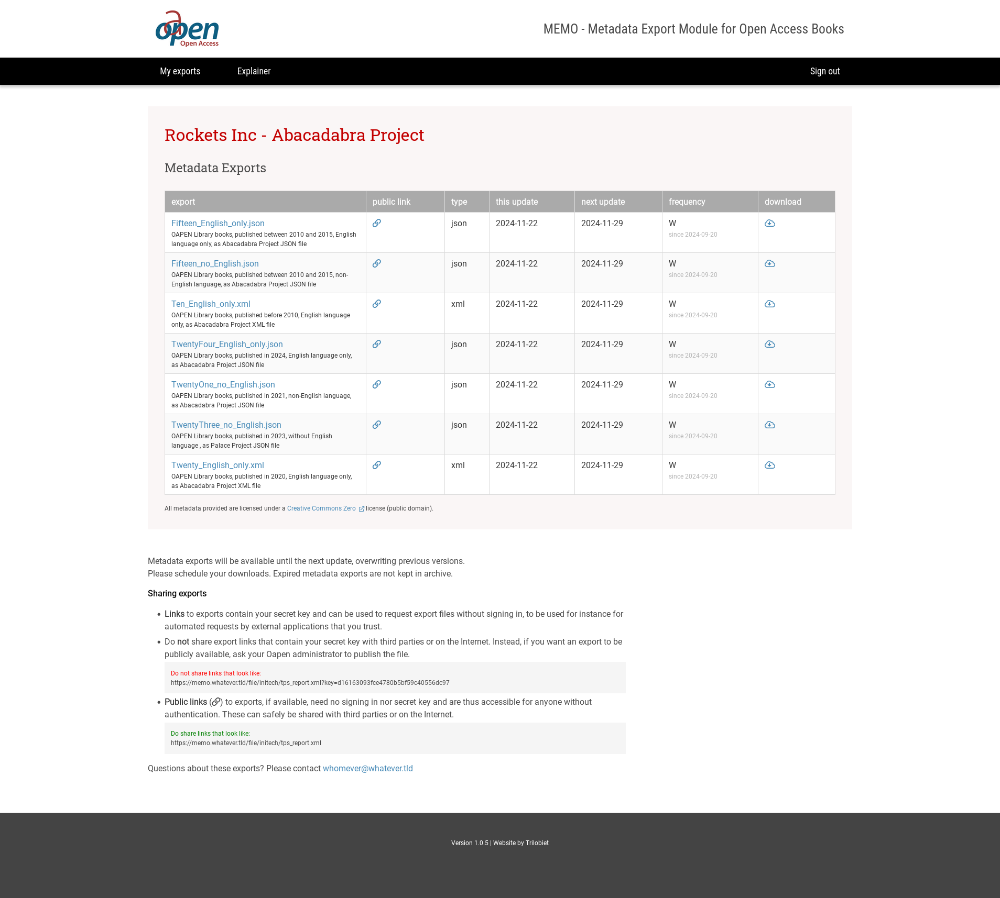

# MEMO Client web

The MEMO Client Web is a web site that serves export files, generated by MEMO Task runner, from the client directories. 

MEMO clients (customers) can download these files. The client web is a restricted area. One needs a user account to access the site. Clients can only view their own data.

For a more precise description of the MEMO Client Web application, including instructions on how to install, configure and run, go to https://github.com/trilobiet/oapenmemoclientweb.

