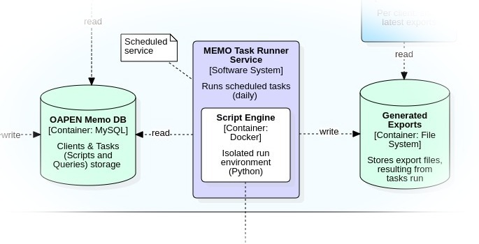

# MEMO Task runner

A deamon application that runs tasks defined in the MEMO database. On each run Task Runner queries the database to see which tasks are due to be run. The output of each task is then saved as a file in the corresponding clients' directory.

Tasks are always tied to exactly 1 client. Each task has a name and an extension, which together make up the file name. No history is saved, so on each task run the previous version of the resulting file is overwritten.

MEMO Task runner must have read access to the MEMO database and write access to any system path to store export files.

MEMO Task Runner runs on schedule, but since it also should be able to generate exports instantly on request - for instance to perform (dry) runs from MEMO Manager, it must listen continuously to HTTP requests and therefore be installed as a service.

For a more precise description of the MEMO Task Runner application, including instructions on how to install, configure and run, go to https://github.com/trilobiet/oapenmemotaskrunner.

