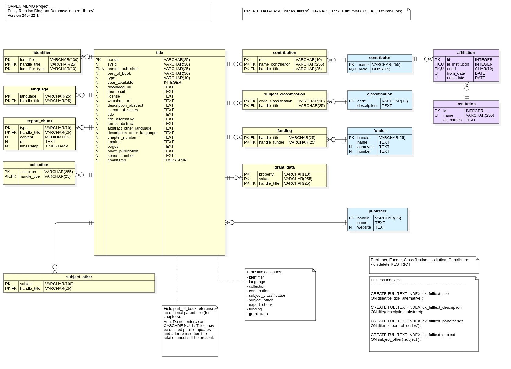
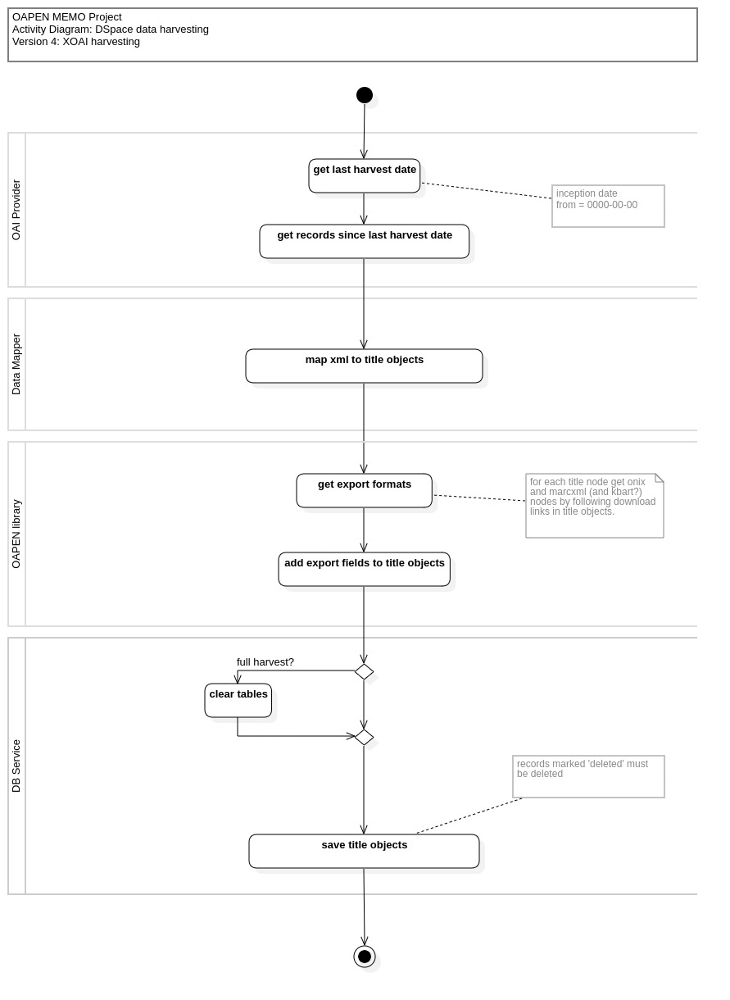

#  OAPEN Data

OAPEN Library data is stored locally in a MySQL database that is a relational mapping of data retrieved from OAPEN DSpace, harvested through the OAI protocol and synchronized daily with the OAI provider at `library.oapen.org/oai`. 

To initialy populate the local datastore and synchronize afterwards, an OAI harvester application is run as a daily job, keeping track of harvesting status.

The resulting database can be used as a datasource for MEMO export file generation, but its use is not restricted to that, since it contains quite a complete description of the collection of OAPEN titles (books and chapters) and associated data.

For a more precise description of the Harvester application, including instructions on how to install, configure and run, go to [https://github.com/trilobiet/oapenmemoharvester](https://github.com/trilobiet/oapenmemoharvester).

## Database 

A script to create the empty OAPEN Library database is included in directory [/Storage/MySQL-scripts](./Storage/MySQL-scripts/). 

The view definition `vw_title_combined_fields.sql` in the same directory serves to abstract away some frequently used SQL joins, allowing for more compact query SQL where desired, but it can be ignored if there is no such wish.

### Database ERD

## XOAI Harvesting process

*Diagrams and HTML Database documentation are created with StarUML Professional 6.0.0*