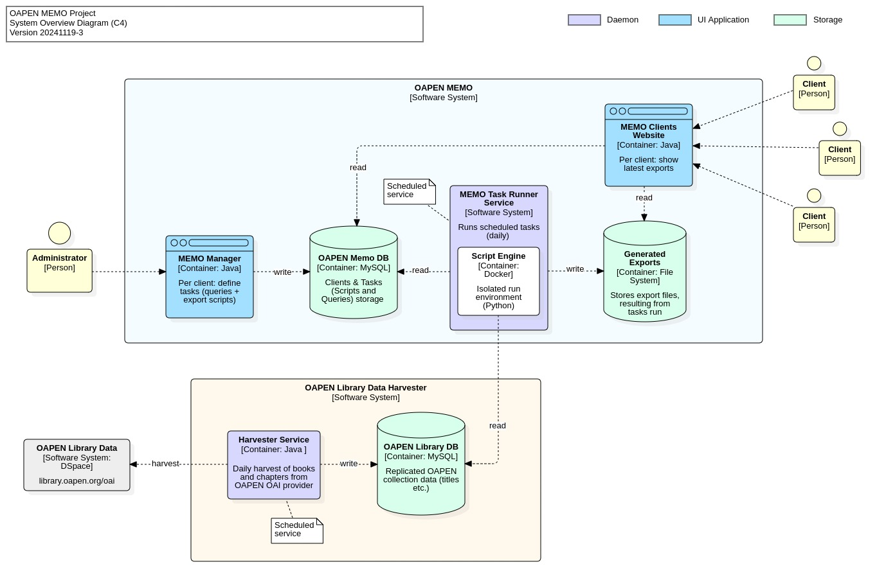

# MEMO/Data

A tool for creating and synchronizing data mappings from any datasource. 

MEMO periodically runs mapping tasks written in SQL and Python, in an isolated environment. Tasks are primarily focused on generating export files that contain a subset of data in a format of choice (XML, JSON, HTML, etc.). Tasks can be written exclusively for a specific client and the resulting files are published in a client web directory.

## MEMO suite

MEMO consists of 3 parts:

* [MEMO Manager](./MEMO/MEMO-Manager/README.md), an application only accessible to MEMO administrator/editor. Here clients and their tasks are created, stored and edited;
* [MEMO Task Runner](./MEMO/MEMO-Taskrunner/README.md), a deamon that selects the tasks that must be run;
* [MEMO Client web](./MEMO/MEMO-Clientweb/README.md), the client web directory showing resulting files. 

These parts are all described in detail in the respective subdirectories.

## Data source

Tasks, consisting of SQL and Python scripts, are data themselves and MEMO is ignorant of the contents of these scripts. Scripts are run periodically in an isolated environment. Only their output is grabbed by MEMO and written to the associated client directory. To provide these scripts with data to generate files from, we need a data input source. This can be any data source, local or on the internet. 

* [OAPEN Library data](./OAPEN-Data/README.md)   
For OAPEN, data is harvested from OAPEN's OAI provider and stored in a local relational database. This database replicates the entire OAPEN Library collection of books and titles, in a derived relational model. This data model guarantees high availablity and enables usage of complex SQL queries with short response times.

The harvester(s) taking care of populating and synchronizing the database are described in detail in the corresponding subdirectory.

## System Diagram

